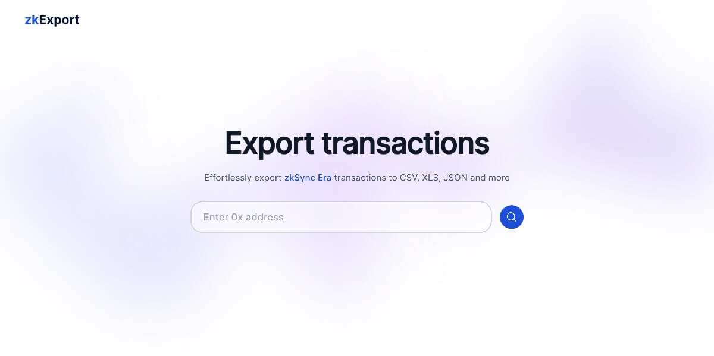

# zkExport: **Export zkSync Era** and Lite transactions

zkExport makes it easy to **export zkSync Era** and Lite transactions to different table formats like CSV or XLS. Anyone can use it to get their transaction data for checking, studying, or just keeping records.

## 🚀 Quick Start

Use zkExport directly via [zkExport.netlify.app](https://zkexport.netlify.app).

## 🌐 Supported Networks

zkExport currently supports the following networks:

- **zkSync Era Mainnet**
- **zkSync Era Testnet**
- zkSync Lite Mainnet
- zkSync Lite Goerli Testnet

## 📄 Supported File Formats

Flexible **export** options with various file formats to cater to different use-cases:

- **CSV**
- XLS (XLSX)
- XML
- ODS
- HTML
- TXT
- JSON
